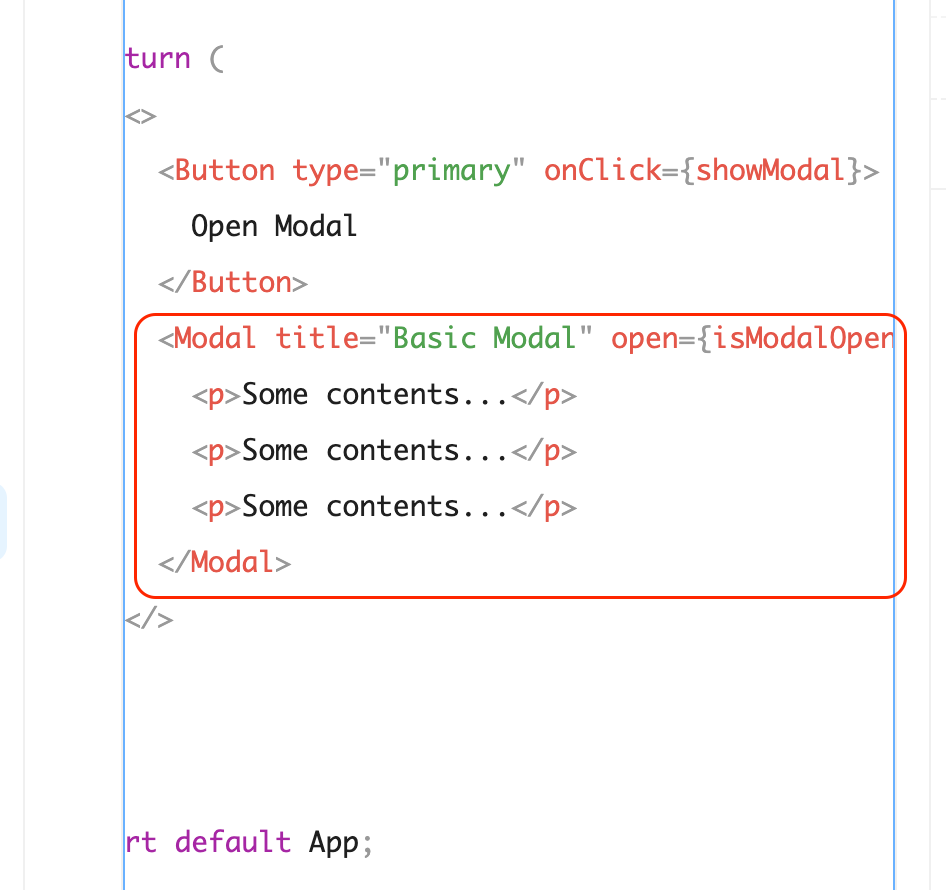
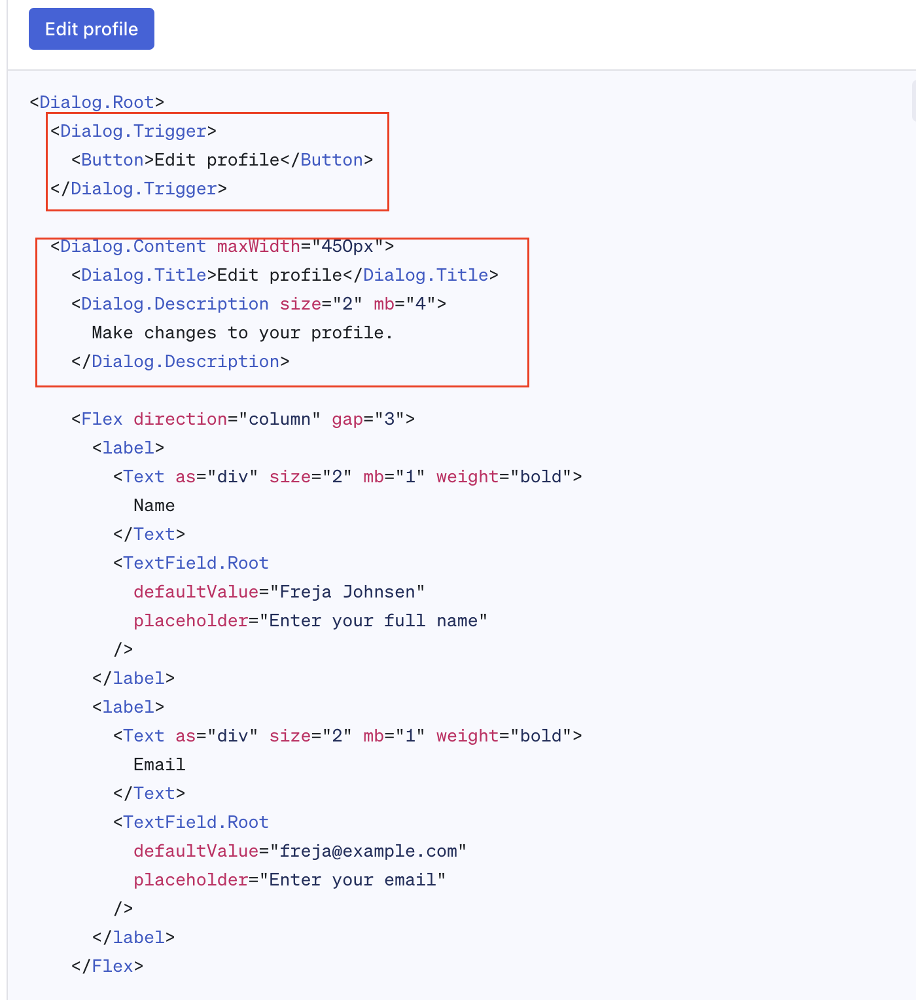
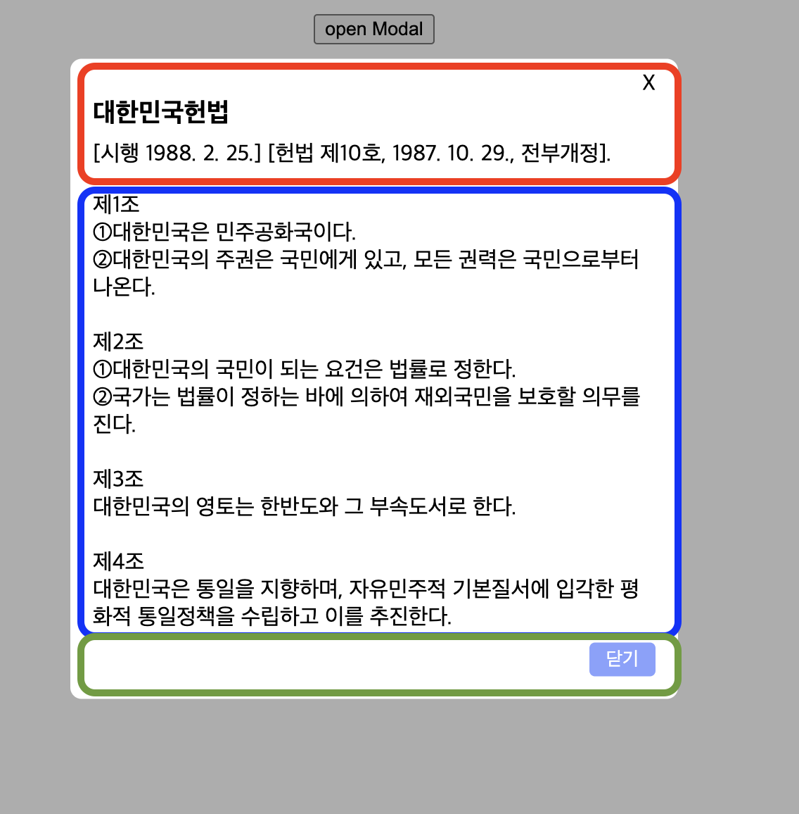

# Compound 패턴
> 컴파운드 컴포넌트 패턴은 여러 컴포넌트들이 모여 하나의 동작을 할 수 있게 해 준다. 

내가 컴파운드 패턴을 처음 알게 된 것은 [Radix 의 Dialog](https://www.radix-ui.com/themes/docs/components/dialog) 컴포넌트에서 였다.

Headless UI 라이브러리로 Radix 를 추천받아서 사용하기 위해 둘러보던 중 Dialog 컴포넌트를 보게 됐는데, 
`<Dialog.Root>`, `<Dialog.Trigger>`, `<Dialog.Content>`, `<Dialog.Title>`, `<Dialog.Description>` ... 이런 식으로 나뉘어져 있어서 내 프로젝트에서 필요한 부분만 조합해 새롭게 디자인해서 사용할 수 있다.

Mui, Antd 라이브러리의 컴포넌트들처럼 하나의 컴포넌트로 묶여 있다면 Dialog 내부의 각 요소에 대한 커스텀에 비교적 한계가 있는데, Compound 패턴의 컴포넌트는 Dialog 로서의 기능은 유지하면서 여러 디자인에 유연하게 대응할 수 있다는 장점이 있다.

| |Antd 의 모달 컴포넌트 | Radix 의 Dialog 컴포넌트 |
|---|---|---|
|img | | |
| 설명 |title 등의 값을 props 로 넘겨준다. |Dialog.Trigger, Dialog.Content 등을 조합해서 사용할 수 있다.|


## 완성본
React, Styled-component 사용
https://codesandbox.io/p/sandbox/compound-modal-f896jp


## Compound 패턴의 Modal 만들기

모달, 드롭다운, 퍼널 등 다양한 컴포넌트에서 활용할 수 있는데, 주로 모달을 컴파운드 패턴으로 만들어야할 일이 많았다.\
아무래도 모달로서의 기능은 유지한 채, 모달 내부 타이틀, 컨텐츠, 버튼 등의 디자인이 다양한 경우가 많아서 (그리고 도중에 새 디자인이 추가되는 경우가 많아서 🫠) 인 것 같다.

### 1. 모달에 들어갈 요소 컴포넌트 만들기



각 프로젝트의 디자인 등을 고려하여, 모달에 필요한 부분을 나누어서 각 컴포넌트를 만들어준다.
나는 `Title`, `Content`, `Footer` 로 나누어 보았다.

```tsx
// 모달 Title
export function ModalTitle({ children, ...props }: ModalChildProps) {
  return (
    <Title {...props}>
      <CloseX>X</CloseX>
      <Flex direction="column" gap={8}>
        {children}
        <Divider />
      </Flex>
    </Title>
  );
}

// 모달 Content
export function ModalContent({ children, ...props }: ModalChildProps) {
  return <div {...props}>{children}</div>;
}

// 모달 Footer
export function ModalFooter({
  children,
  gap = 4,
  ...flexProps
}: ModalFooterProps) {
  return (
    <Footer gap={gap} {...flexProps}>
      {children}
    </Footer>
  );
}
```

### 2. 각 요소 컴포넌트들을 Modal 컴포넌트의 속성으로 합쳐준다.

2-1. 모달에 필요한 기능을 구현하고,
- portal 로 모달 최상단에 띄우기, open = true 일 때 모달 컴포넌트 마운트, onClose 로 모달 컴포넌트 언마운트, 배경 클릭 시 모달 닫힘.... 등


2-2. `Modal.Title`, `Modal.Content`, `Modal.Footer` 로 사용할 수 있도록 **Object.assign** 으로 묶어준다.
```js
Modal.Title = Title;
Modal.Content = Content;
Modal.Footer = Footer;
```
`Object.assign(Modal, {
  Title: ModalTitle,
  Content: ModalContent,
  Footer: ModalFooter,
})
` 은 Modal 의 속성에 각 컴포넌트를 연결하는 과정으로 위와 같이 Modal의 프로퍼티로 할당하는 역할을 한다.

```tsx
function Modal({
  children,
  open = false,
  onClose,
  className,
  ...props
}: ModalProps) {
  const [portalEl, setPortalEl] = useState<Element | null>(null);

  useEffect(() => {
    if (open) {
      document.body.style.overflowY = "hidden";
    } else {
      document.body.style.overflowY = "auto";
    }
  }, [open]);

  useEffect(() => {
    setPortalEl(document.getElementById("portal"));
    return () => {
      document.body.style.overflowY = "auto";
    };
  }, []);

  const handleClickOutSide = () => {
    document.body.style.overflowY = "auto";
    return onClose();
  };

  return (
    open &&
    portalEl &&
    createPortal(
      <>
        <Background onClick={handleClickOutSide} />
        <ModalContainer className={className} {...props}>
          {children}
        </ModalContainer>
      </>
      ,
      document.body
    )
  );
}

export default Object.assign(Modal, {
  Title: ModalTitle,
  Content: ModalContent,
  Footer: ModalFooter,
});
```

### 3. 모달의 요소 컴포넌트에 전달이 필요한 props 를 context API 로 전달한다.

onClose props 가 모달 Title X 버튼에서도 필요하므로 Context Api 로 넘겨줬다.
이 외에도 close button 유무, z-index 값 등 props 로 각 요소에 전달이 필요한 값이 있는 경우 전달해줄 수 있다.

```tsx
export const ModalContext = createContext<{ onClose: () => void } | null>(null);


function Modal({ /* ...생략  */}: ModalProps) {
  //... 생략
    return (
    open &&
    portalEl &&
    createPortal(
      <ModalContext.Provider value={{ onClose }}>
        <Background onClick={handleClickOutSide} />
        <ModalContainer className={className} {...props}>
          {children}
        </ModalContainer>
      </ModalContext.Provider>,
      document.body
    )
  );
}

// 모달 Title

export function ModalTitle({ children, ...props }: ModalChildProps) {
  const context = useContext(ModalContext);

  return (
    <Title {...props}>
      <CloseX onClick={context?.onClose}>X</CloseX>
      <Flex direction="column" gap={8}>
        {children}
        <Divider />
      </Flex>
    </Title>
  );
}

```
### 4. 필요한 디자인으로 각 요소들을 조합해서 모달 컴포넌트를 만든다.
```tsx

export default function RawModal({ open, onClose }: Props) {
  return (
    <Modal open={open} onClose={onClose}>
      <Modal.Title>
        <H3>대한민국헌법</H3>
      </Modal.Title>
      <Modal.Content>
        제1조 <br />
        ①대한민국은 민주공화국이다. <br />
        ②대한민국의 주권은 국민에게 있고, 모든 권력은 국민으로부터 나온다.
      </Modal.Content>
      <Modal.Footer>
        <CloseButton onClick={onClose}>닫기</CloseButton>
      </Modal.Footer>
    </Modal>
  );
}

// App.tsx
export default function App() {
  const { open, closeModal, openModal } = useModal();

  return (
    <div className="App">
      <button onClick={openModal}>open Modal</button>
      <RawModal open={open} onClose={closeModal} />
    </div>
  );
}
```

